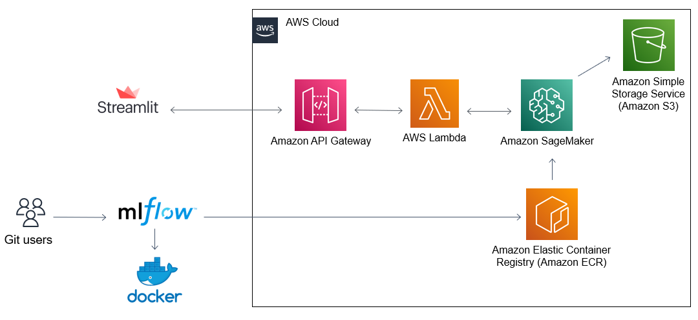

# Deploying Models to Production with MLflow and AWS (Sagemaker, Lambda function, API Gateway)

This repo show you how to prepare you Machine Learning model for production in AWS with the help of MLflow and AWS Command Line Inteface (AWS CLI).
The image below shows the architecture and technologies used in this project.

## Requirements

- AWS Account.
- Docker installed on your local machine.
- Anaconda software to create conda virtual environment.

## Setup the environment
Installing mlflow to your dedicated virtual environment

### Step 1. Prepare your Python Virtual environment

We will create dedicated virtual environment. 
- Create a new conda virtual environment in you working directory with the following command in your terminal: `conda create --name deploy_ml python=3.6`
- Once your virtual environment is sucessfully created, you can easily to activate it with the following command: `conda activate deploy_ml`

### Step 2. Install dependencies in you virtual environment

* Install *mlflow* package into our virtual environment with the following command: `pip install -q mlflow==1.18.0`.
* To run properly the ML model itself we have to install following modules and packages to our virtual environment:
    * Pandas: `pip install pandas`.
    * Scikit-learn: `pip install -U scikit-learn`.
    * AWS Command Line Interface (AWS CLI): `pip install awscli --upgrade --user`.
    * Boto3: `pip install boto3`.

### Step 3. Setup AWS IAM User and AWS CLI configuration

* **Create a new AWS AIM User**
    * Open **Identity and Access management (IAM) dashboard**.
    * Click on **Users**.
    * Click **Add users** on the right side of the screenshot.
    * Set the *User name* and mark *Programmatic access* tick below.
    * Click on **Create group** as the part of *Add user to group* option.
    * Type a group name you want to assign to your IAM User.
    * From the list below select following policies:
        * AmazonSageMakerFullAccess.
        * AmazonEC2ContainerRegistryFullAccess.
    * Click on **Create group**, then the current *Policies* window will be closed.
    * Click on **Next: Tags**.
    * Click on **Next: Review**.
    * Click on **Create user**.
    * You will get a notification about sucessfully created new User on AWS IAM.
    **Important.** Keep safe you credentials on your own notes. This step is only one occasion you see AWS Secret Access Key. Rewrite it carefully.

* **Setup AWS CLI configuration**
    * Be sure you have installed *AWS CLI* and type command in your terminal: `aws configure`.
    * Then you will have to enter your own credentials as follows:
        * **AWS Access Key ID**: go to *IAM*, then Users, and click on your user just created. Select *Security credentials* tab and copy the value of *AWS Access Key ID*
        * **AWS Secret Access Key**: paste this code from your own notes. You have seen this code originally from *Security credentials* of your user.
        * **Default region name**: go to main AWS interface, click on your region, and check which region is activated for you (us-east-1, eu-west-1, and so on).
        * **Default output format**: set it as *json*.

### Step 4. Test if *mlflow* is working good
* Before doing all following steps, we must be sure if our freshly installed *mlflow* service if working good on our local machine. To do it, type the following command in the terminal: `mlflow ui`.
* Open the *mlflow* dashboard on you browser by entering following URL to your *localhost*: ``http://127.0.0.1:5000``. Please keep in mind that this service uses port 5000 on your machine (open the second terminal window on the same working directory before run this command).

You should see mlflow dashboard interface

## Create Machine Learning model for *mlflow*
### Step 1. Adapt your ML training code for mlflow
### Step 2. Run the model and track metrics in mlflow

## Deploy the model to AWS
### Step 1. Build a Docker Image and push it to AWS ECR
### Step 2. Deploy image to Sagemaker

## Create Lamba Function on AWS

## Create REST Api with AWS Gateway

## Use REST API with a simple Webapp using streamlit

- [Demo Web App](https://streamlit-app-challenge.herokuapp.com/)
